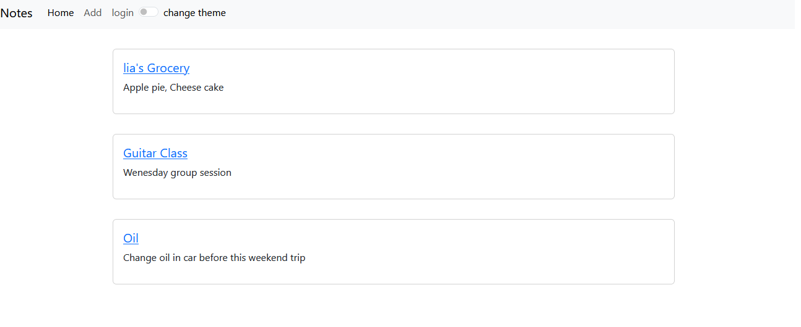
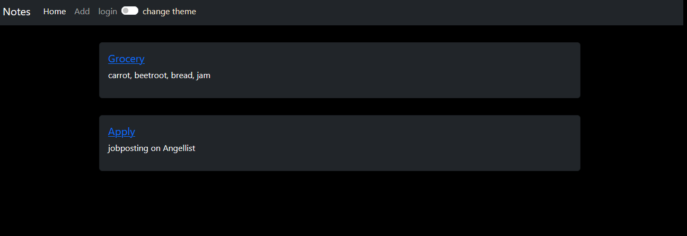

# Django Notes

Django notes is a notes app which allows to add, edit, and delete entries.

User can login can have individual and secure notes.
DEMO:

Lia's Notes. 


John's notes. John has choosen dark theme.




## Installation

Use the package manager [pip](https://pip.pypa.io/en/stable/) to install requirements.

```bash
pip install mysql
pip install django
pip install mysql-connector-python
```

## Usage

Create and apply the db migrations

```bash
python manage.py makemigrations
pyhton manage.py migrate
```

Create a super user using

```bash
python manage.py createsuperuser
```
To run Server

```bash
python manage.py runserver
```
## Tech Stack

For backend python Django framework is used

For database MySql is used  

## Contributing

Pull requests are welcome. For major changes, please open an issue first
to discuss what you would like to change.

Please make sure to update tests as appropriate.

## License

[MIT](https://choosealicense.com/licenses/mit/)